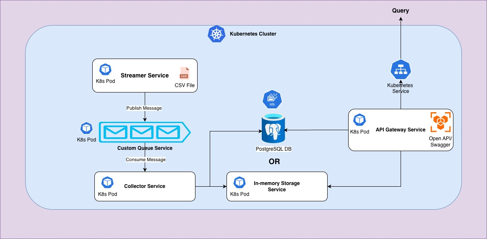

# Elastic GPU Telemetry Pipeline

A scalable, production-ready telemetry pipeline for AI clusters that collects, processes, and exposes GPU telemetry data through a custom message queue architecture.

## Table of Contents

- [Overview](#overview)
- [Architecture](#architecture)
- [Key Features](#key-features)
- [Prerequisites](#prerequisites)
- [Quick Start](#quick-start)
- [Build and Packaging](#build-and-packaging)
- [Deployment](#deployment)
- [API Documentation](#api-documentation)
- [User Workflow](#user-workflow)
- [Testing](#testing)
- [Configuration](#configuration)
- [Troubleshooting](#troubleshooting)

## Overview

The Elastic GPU Telemetry Pipeline is designed to handle telemetry data from AI clusters containing multiple hosts, each potentially hosting multiple GPUs. The system processes GPU metrics (utilization, temperature, memory, power, etc.) through a distributed pipeline that supports horizontal scaling.

### What This System Does

1. **Ingests** GPU telemetry data from CSV files (simulating real-time streams)
2. **Processes** telemetry through a custom message queue
3. **Stores** processed data in a queryable storage layer
4. **Exposes** telemetry data via RESTful APIs with OpenAPI documentation

### Key Design Principles

- **Scalability**: Support up to 10 instances of streamers and collectors
- **Extensibility**: Pluggable storage backends (in-memory → PostgreSQL)
- **Observability**: Comprehensive logging and error handling
- **Production-Ready**: Kubernetes-native with Helm charts
- **Clean Architecture**: SOLID principles, repository pattern, dependency injection

## Architecture

### System Components

The pipeline consists of five main services:

1. **Telemetry Streamer** (`cmd/streamer/`)
   - Reads telemetry data from CSV files
   - Publishes messages to the message queue
   - Supports multiple concurrent instances
   - Loops CSV data to simulate continuous streams

2. **Custom Message Queue** (`cmd/queue-service/`)
   - Custom-built message queue (no external dependencies)
   - HTTP-based publish/subscribe interface
   - Supports fan-out to multiple collectors
   - In-memory implementation with optional persistence

3. **Telemetry Collector** (`cmd/collector/`)
   - Consumes messages from the queue
   - Parses and validates telemetry data
   - Persists data to storage
   - Supports multiple concurrent instances

4. **Storage Service** (`cmd/storage-service/`)
   - Centralized storage abstraction
   - In-memory implementation (extensible to Postgres)
   - Provides HTTP API for data access
   - Indexed queries for efficient retrieval

5. **API Gateway** (`cmd/api-gateway/`)
   - RESTful HTTP API
   - OpenAPI/Swagger documentation
   - Query endpoints for GPU telemetry
   - Health checks and observability

### Architecture Diagram


### Data Flow

1. **Ingestion**: Streamers read CSV rows and publish to queue
2. **Buffering**: Queue service buffers messages for collectors
3. **Processing**: Collectors consume, parse, and validate messages
4. **Storage**: Processed data is persisted to storage service
5. **Query**: API Gateway queries storage and serves HTTP responses

### Design Considerations

- **Message Queue**: Custom implementation using Go channels and HTTP, designed for up to 10 producer/consumer instances
- **Storage Abstraction**: Repository pattern allows swapping in-memory storage for PostgreSQL/MongoDB without code changes
- **Scalability**: All services are stateless and horizontally scalable
- **Fault Tolerance**: Graceful shutdown, error handling, and health checks
- **Observability**: Structured logging, request tracing, and health endpoints

## Key Features

- ✅ **Custom Message Queue**: No external dependencies (Kafka, RabbitMQ, etc.)
- ✅ **Horizontal Scaling**: Support for multiple streamer/collector instances
- ✅ **RESTful API**: OpenAPI/Swagger documentation
- ✅ **Kubernetes Native**: Helm charts for easy deployment
- ✅ **Comprehensive Testing**: Unit tests with 89.7% code coverage
- ✅ **Production Ready**: Docker images, health checks, graceful shutdown
- ✅ **Extensible**: Pluggable storage backends

## Prerequisites

### Required Tools

- **Go 1.22+**: [Installation Guide](https://go.dev/doc/install)
- **Docker**: [Installation Guide](https://docs.docker.com/get-docker/)
- **kind**: Kubernetes in Docker for local testing
  ```bash
  # macOS
  brew install kind
  
  # Linux
  curl -Lo ./kind https://kind.sigs.k8s.io/dl/v0.20.0/kind-linux-amd64
  chmod +x ./kind
  sudo mv ./kind /usr/local/bin/kind
  ```
- **Helm 3.0+**: [Installation Guide](https://helm.sh/docs/intro/install/)
  ```bash
  # macOS
  brew install helm
  ```
- **kubectl**: [Installation Guide](https://kubernetes.io/docs/tasks/tools/)

### Verify Installation

```bash
go version        # Should be 1.22 or higher
docker --version
kind --version
helm version
kubectl version --client
```

## Quick Start

### One-Command Local Deployment

Deploy the entire stack to a local Kubernetes cluster with a single command:

```bash
make deploy-local
```

This command will:
- ✅ Check all dependencies
- ✅ Create a kind cluster (if it doesn't exist)
- ✅ Build all Docker images
- ✅ Load images into the cluster
- ✅ Deploy all services via Helm
- ✅ Wait for pods to be ready
- ✅ Start port forwarding to API Gateway

After deployment completes, access:
- **API Gateway**: http://localhost:8081
- **Swagger UI**: http://localhost:8081/swagger/index.html

### Stop Port Forwarding

```bash
make port-forward-stop-local
```

### Cleanup

```bash
make cleanup-local
```

## Build and Packaging

### Build Binaries

Build all service binaries:

```bash
make build
```

Binaries will be created in the `bin/` directory:
- `bin/streamer`
- `bin/collector`
- `bin/api-gateway`
- `bin/queue-service`
- `bin/storage-service`

### Build Docker Images

Build all Docker images:

```bash
make docker-all
```

Or build individually:

```bash
make docker-streamer
make docker-collector
make docker-api-gateway
make docker-queue-service
make docker-storage-service
```

### Custom Image Tags

```bash
make docker-all DOCKER_TAG=v1.0.0
```

### Clean Build Artifacts

```bash
make clean          # Remove binaries
make docker-clean   # Remove Docker images
```

## Deployment

### Local Deployment (kind)

#### Option 1: One-Command Deployment (Recommended)

```bash
make deploy-local
```

#### Option 2: Manual Step-by-Step

1. **Check Dependencies**
   ```bash
   make check-deps-local
   ```

2. **Create kind Cluster**
   ```bash
   make kind-create-local
   # Or manually:
   kind create cluster --name gpu-telemetry
   ```

3. **Build and Load Images**
   ```bash
   make kind-load-images-local
   ```

4. **Deploy Helm Chart**
   ```bash
   make helm-deploy-local
   ```

5. **Wait for Pods**
   ```bash
   make wait-for-pods-local
   ```

6. **Start Port Forwarding**
   ```bash
   make port-forward-bg-local
   ```

### Production Deployment

For production deployments, you'll need:

1. **Container Registry**: Push images to a registry (Docker Hub, GCR, ECR, etc.)
2. **Kubernetes Cluster**: Production-grade cluster (EKS, GKE, AKS, etc.)
3. **Helm Chart**: Install with production values

```bash
# Build and push images
make docker-all DOCKER_TAG=v1.0.0
docker push your-registry/elastic-gpu-telemetry-streamer:v1.0.0
# ... push other images

# Install Helm chart
helm install elastic-gpu-telemetry ./charts/elastic-gpu-telemetry \
  --set global.imageRegistry=your-registry \
  --set streamer.replicaCount=3 \
  --set collector.replicaCount=3
```

See [KUBERNETES.md](./KUBERNETES.md) for detailed deployment instructions.

### Scaling Services

Scale streamers and collectors:

```bash
helm upgrade elastic-gpu-telemetry ./charts/elastic-gpu-telemetry \
  --set streamer.replicaCount=5 \
  --set collector.replicaCount=3
```

## API Documentation

### Generate OpenAPI Specification

Generate the OpenAPI/Swagger specification:

```bash
make swagger
```

Or use the alias:

```bash
make openapi
```

This generates:
- `docs/swagger/swagger.json` - OpenAPI 3.0 JSON
- `docs/swagger/swagger.yaml` - OpenAPI 3.0 YAML
- `docs/swagger/docs.go` - Generated Go code

### View API Documentation

#### Option 1: Swagger UI (Interactive)

1. Start the API Gateway:
   ```bash
   make run-api
   # Or if deployed: make port-forward-bg-local
   ```

2. Open in browser:
   ```
   http://localhost:8081/swagger/index.html
   ```

#### Option 2: View Generated Files

```bash
# View JSON
cat docs/swagger/swagger.json

# View YAML
cat docs/swagger/swagger.yaml
```

### API Endpoints

#### List All GPUs

```bash
GET /api/v1/gpus
```

**Response:**
```json
{
  "gpus": [
    {
      "uuid": "GPU-5fd4f087-86f3-7a43-b711-4771313afc50",
      "gpu_id": "0",
      "device": "nvidia0",
      "model_name": "NVIDIA H100 80GB HBM3",
      "hostname": "mtv5-dgx1-hgpu-031"
    }
  ],
  "count": 1
}
```

#### Get Telemetry by GPU

```bash
GET /api/v1/gpus/{uuid}/telemetry?start_time=2025-01-01T00:00:00Z&end_time=2025-01-01T23:59:59Z
```

**Query Parameters:**
- `start_time` (optional): ISO 8601 timestamp (inclusive)
- `end_time` (optional): ISO 8601 timestamp (inclusive)

**Response:**
```json
{
  "gpu_uuid": "GPU-5fd4f087-86f3-7a43-b711-4771313afc50",
  "telemetry": [
    {
      "metric_name": "DCGM_FI_DEV_GPU_UTIL",
      "value": "85.5",
      "ingestion_time": "2025-01-01T12:00:00Z"
    }
  ],
  "count": 1
}
```

## User Workflow

### Complete Workflow Example

1. **Deploy the System**
   ```bash
   make deploy-local
   ```

2. **Generate API Documentation**
   ```bash
   make swagger
   ```

3. **Access Swagger UI**
   - Open: http://localhost:8081/swagger/index.html
   - Or ensure port forwarding is active: `make port-forward-bg-local`

4. **Test API Endpoints**

   **List all GPUs:**
   ```bash
   curl http://localhost:8081/api/v1/gpus
   ```

   **Get telemetry for a specific GPU:**
   ```bash
   # First, get a GPU UUID from the list above
   GPU_UUID="GPU-5fd4f087-86f3-7a43-b711-4771313afc50"
   
   # Get all telemetry
   curl "http://localhost:8081/api/v1/gpus/${GPU_UUID}/telemetry"
   
   # Get telemetry with time filter
   curl "http://localhost:8081/api/v1/gpus/${GPU_UUID}/telemetry?start_time=2025-01-01T00:00:00Z&end_time=2025-01-01T23:59:59Z"
   ```

5. **View Service Logs**
   ```bash
   # Streamer logs
   kubectl logs -l app.kubernetes.io/component=streamer -f
   
   # Collector logs
   kubectl logs -l app.kubernetes.io/component=collector -f
   
   # API Gateway logs
   kubectl logs -l app.kubernetes.io/component=api-gateway -f
   ```

6. **Check Service Status**
   ```bash
   kubectl get pods
   kubectl get svc
   helm status elastic-gpu-telemetry
   ```

7. **Cleanup**
   ```bash
   make cleanup-local
   ```

## Testing

### Run Tests

Run all unit tests with race detection:

```bash
make test
```

### Generate Coverage Report

Generate HTML coverage report:

```bash
make cover
```

Open `coverage.html` in your browser to view detailed coverage.

### View Coverage by Function

```bash
make cover-func
```

### Test Coverage

Current test coverage: **89.7%** (excluding `cmd/` packages)

See [docs/TESTING.md](./docs/TESTING.md) for detailed testing documentation.

## Configuration

### Environment Variables

#### Streamer

- `CSV_FILE_PATH`: Path to CSV file (default: `/app/csv/dcgm_metrics_20250718_134233.csv`)
- `STREAM_INTERVAL_MS`: Interval between messages in milliseconds (default: `100`)
- `STREAMER_INSTANCE_ID`: Unique instance identifier
- `QUEUE_SERVICE_URL`: Queue service URL (default: in-memory queue)

#### Collector

- `COLLECTOR_BATCH_SIZE`: Batch size for processing messages (default: `10`)
- `COLLECTOR_INSTANCE_ID`: Unique instance identifier
- `QUEUE_SERVICE_URL`: Queue service URL (default: in-memory queue)
- `STORAGE_SERVICE_URL`: Storage service URL (default: in-memory storage)

#### API Gateway

- `API_PORT`: HTTP server port (default: `8081`)
- `STORAGE_SERVICE_URL`: Storage service URL (default: in-memory storage)

#### Queue Service

- `QUEUE_PORT`: HTTP server port (default: `8080`)
- `QUEUE_BUFFER_SIZE`: Message buffer size (default: `1000`)

#### Storage Service

- `STORAGE_PORT`: HTTP server port (default: `8082`)

### Helm Configuration

Edit `charts/elastic-gpu-telemetry/values.yaml` or use `--set` flags:

```bash
helm install elastic-gpu-telemetry ./charts/elastic-gpu-telemetry \
  --set streamer.replicaCount=3 \
  --set collector.replicaCount=2 \
  --set streamer.env.STREAM_INTERVAL_MS=50
```

See [charts/elastic-gpu-telemetry/README.md](./charts/elastic-gpu-telemetry/README.md) for all configuration options.

## Troubleshooting

### Pods Not Starting

```bash
# Check pod status
kubectl get pods

# Describe pod for details
kubectl describe pod <pod-name>

# Check events
kubectl get events --sort-by='.lastTimestamp'
```

### Images Not Found

Ensure images are loaded into kind:

```bash
docker images | grep elastic-gpu-telemetry
make kind-load-images-local
```

### Service Not Accessible

```bash
# Check service endpoints
kubectl get endpoints

# Check service details
kubectl describe svc api-gateway

# Restart port forwarding
make port-forward-stop-local
make port-forward-bg-local
```

### Empty API Responses

If API returns empty data:

1. **Check if streamer is running:**
   ```bash
   kubectl logs -l app.kubernetes.io/component=streamer
   ```

2. **Check if collector is running:**
   ```bash
   kubectl logs -l app.kubernetes.io/component=collector
   ```

3. **Verify services are connected:**
   - Streamer → Queue Service
   - Collector → Queue Service
   - Collector → Storage Service
   - API Gateway → Storage Service

4. **Check environment variables:**
   ```bash
   kubectl get deployment streamer -o yaml | grep -A 10 env
   ```

### Port Forward Issues

```bash
# Stop existing port forward
make port-forward-stop-local

# Check if port is in use
lsof -i :8081

# Start fresh port forward
make port-forward-bg-local
```

For more troubleshooting, see [KUBERNETES.md](./KUBERNETES.md) and [docs/RUNNING_SERVICES.md](./docs/RUNNING_SERVICES.md).


## Additional Documentation

- [Design Document](./docs/design.md) - Detailed architecture and design decisions
- [API Documentation](./docs/API_README.md) - API endpoint details
- [Kubernetes Deployment](./KUBERNETES.md) - Production deployment guide
- [Quick Start](./QUICKSTART.md) - Quick reference guide
- [Testing Guide](./docs/TESTING.md) - Testing strategy and coverage
- [Running Services](./docs/RUNNING_SERVICES.md) - Local development guide
- [Docker Guide](./DOCKER.md) - Docker build and image details
- [Helm Chart](./charts/elastic-gpu-telemetry/README.md) - Helm chart documentation

